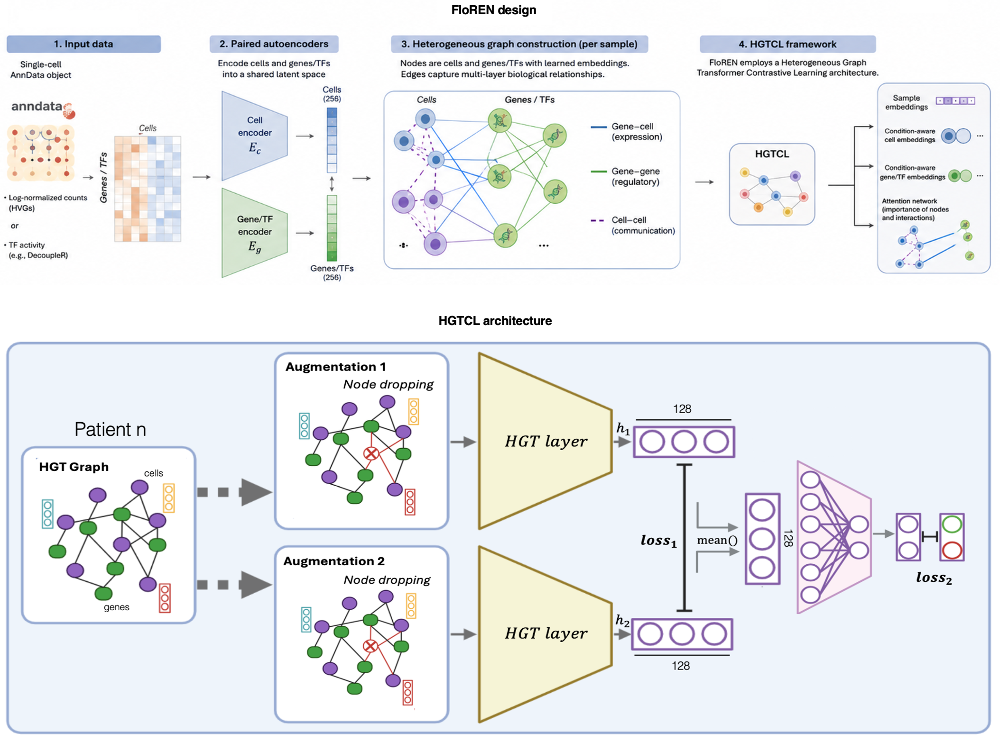

# FloREN: An Interpretable Sample Representation Method to unveil immune networks through Graph Transformers

<p align="center">
  
</p>


## 📥 Setup & Installation

### 1. Clone FloREN Locally

```bash
git clone https://github.com/iclemente99/FloREN
cd FloREN
```

### 2. HGT Environment

**Option A — uv (recommended, works on Linux HPC & macOS & Windows)**

```bash
# Install uv once (skip if already installed)
curl -LsSf https://astral.sh/uv/install.sh | sh

# Create a Python 3.8.10 virtual environment and install all dependencies
uv python install 3.8.10
uv venv hgt_env --python 3.8.10
source hgt_env/bin/activate         # Windows: hgt_env\Scripts\activate
uv pip install -r env/hgt_env.txt
```

**Option B — conda**

```bash
conda env create -f env/hgt_env.yml
conda activate hgt_env
```

> **Note for HPC / SLURM users**: if the cluster filesystem is on a different mount than the cache, add `export UV_LINK_MODE=copy` before running `uv pip install` to avoid hardlink warnings.

> **Key dependencies** that must be present for all features:
> `igraph`, `leidenalg` (GRN Leiden analysis) · `dill` (parallel graph processing) · `torch-geometric` (HGT model) · `scipy>=1.10` (sparse matrix support)

### 3. Unzip Prior Knowledge Reference

```bash
# Linux / macOS
mkdir -p temp
unzip ./data/Prior_Knowledge_PRECISEADS_compI_compII.zip -d temp
unzip temp/*.zip -d temp/inner
mv temp/inner/*.csv ./data/Prior_Knowledge_PRECISEADS.csv

# Windows (PowerShell)
Expand-Archive -Path ".\data\Prior_Knowledge_PRECISEADS_compI_compII.zip" -DestinationPath ".\temp"
Get-ChildItem "temp\*.zip" | ForEach-Object { Expand-Archive -Path $_.FullName -DestinationPath "temp\inner" -Force }
Get-ChildItem "temp\inner\*.csv" | Select-Object -First 1 | Copy-Item -Destination ".\data\Prior_Knowledge_PRECISEADS.csv"
```

---

## Understanding the Input

To run the FloREN pipeline, the input data must be organized in the `./data/` directory.

### 1. AnnData object (`./data/`)
- **VARS**: Only the genes you want to model (e.g. 2000 HVGs). `adata.var_names` → gene names.
- **MATRIX**: Default layer is `adata.layers['logcounts']` — change `--count_layer` to use another.
- **OBS**: `adata.obs_names` → cell barcodes. Required columns: `patient_id` (sample ID) and a group column (e.g. `disease`) for the supervised task.

### 2. Cell-Cell Connection Matrices (`./data/cell_connections/`)
- One CSV per sample, named after the sample ID in `adata.obs.patient_id`.
- Square `[M × M]` adjacency matrix where M = number of cells in that sample.
- **Optional**: if not provided, the model runs without cell-communication edges.

---

## 🚀 Usage

### Step 1: Build Heterogeneous Graph

Runs autoencoders for gene/cell compression and infers the gene-regulatory network.

```bash
python src/floren_input.py \
  --adata_path    './data/binvignat_example.h5ad' \
  --cell_comm_path './data/cell_connections/' \
  --output_path   './floren_output/' \
  --epochs        150 \
  --grn_cutoff    0.9
```

> `--grn_cutoff` controls how strict the GRN is (0 = all edges, 1 = no edges). For small datasets use 0.5.

### Step 2: Train HGT with Supervised Fine-tuning

Trains the Heterogeneous Graph Transformer and saves patient/cell/gene embeddings and attention scores.

```bash
python src/floren_training.py \
  --adata_path     './data/binvignat_example.h5ad' \
  --result_dir     './floren_output/' \
  --epochs         100 \
  --patient_id     "patient_id" \
  --metadata_group "disease" \
  --min_count      0
```

#### Resuming a killed or interrupted run

FloREN saves a `checkpoint_latest.pt` at the end of every epoch inside `./floren_output/model/`. If the job is killed (e.g. SLURM OOM or time limit), you can resume exactly where it stopped:

```bash
python src/floren_training.py \
  --adata_path     './data/binvignat_example.h5ad' \
  --result_dir     './floren_output/' \
  --epochs         100 \
  --patient_id     "patient_id" \
  --metadata_group "disease" \
  --min_count      0 \
  --resume
```

The `--resume` flag restores the model weights, optimizer state, learning-rate scheduler, early-stopping counter, and full loss history. Training continues from the epoch after the last completed one. The best-model file is tracked inside the checkpoint, so the correct weights are always used for inference regardless of how many times the run is resumed.

> **Note for SLURM users**: add `--resume` to your job script and submit the same job again after a failure — no other changes are needed.

### Step 3: Visualize Results

Generates UMAP embeddings and attention plots from the trained model.

```bash
python src/floren_visualization.py \
  --adata_path     './data/binvignat_example.h5ad' \
  --result_dir     './floren_output/' \
  --patient_id     "patient_id" \
  --metadata_group "disease"
```

### Step 4: Downstream Analysis

After training, FloREN provides a set of analysis functions in `src/downstream.py`.
Import them directly in a Python script or Jupyter notebook — no retraining required.

**Available functions:**

| Function | What it does |
|---|---|
| `cells_attention_ranking` | Ranks cell types by mean attention score across all patients |
| `gene_signatures` | Builds per-cell-type gene attention profiles and plots the top N genes |
| `differential_abundance_analysis` | Compares cell-type saliency between two patient groups (Mann-Whitney + FDR) |
| `run_differential_gene_expression` | Compares gene embedding shift between groups; outputs a volcano plot |
| `cell_niches_analysis` | Computes within- and cross-group cell-type niche similarity (cosine, Pearson, Euclidean) |
| `plot_grn_leiden_network` | Builds gene co-attention networks and detects Leiden modules per group |
| `cell_communication_profiling` | Cell–cell communication heatmaps: attention-weighted signaling between cell types |
| `immune_network_plot` | Renders the full immune network — cell types + top genes — as a publication-ready graph |

---

**Example — rank cell types by attention saliency:**

```python
import sys
sys.path.insert(0, "src")
from downstream import cells_attention_ranking

saliency = cells_attention_ranking(
    floren_results_path = "./floren_output",
    h5ad_path           = "./data/binvignat_example.h5ad",
    celltype_col        = "cell_type",   # adata.obs column with cell-type labels
    sample_col          = "patient_id",
    agg                 = "mean",        # "mean", "median", or a quantile float
    top_n               = 15,
)
# saliency is a pd.Series sorted by mean score
print(saliency.head(10))
```

Saves `./floren_output/plots/cells_attention_ranking.pdf`.

---

**Example — compare cell-type saliency between two patient groups:**

```python
from downstream import differential_abundance_analysis

results_df, all_cells = differential_abundance_analysis(
    floren_results_path = "./floren_output",
    h5ad_path           = "./data/binvignat_example.h5ad",
    group_assignment    = {"patient_A": "Disease", "patient_B": "Control", "patient_C": "Disease"},
    # alternatively, use a substring rule: ("RA", ["RA", "Control"])
    celltype_col        = "cell_type",
    sample_col          = "patient_id",
    agg                 = "mean",
    scale               = "both",
)
# results_df contains Mann-Whitney U statistics and BH-corrected p-values per cell type
significant = results_df[results_df["p_adj"] < 0.05].sort_values("p_adj")
print(significant[["celltype", "p_adj", "Disease_median", "Control_median"]])
```

Saves `./floren_output/plots/differential_abundance_analysis.pdf`.

---

**Example — cell–cell communication profiling:**

```python
import scanpy as sc
from downstream import cell_communication_profiling

adata = sc.read_h5ad("./data/binvignat_example.h5ad")
meta = adata.obs[["cell_type", "patient_id"]].copy()
meta.columns = ["celltype", "patient"]
meta["barcode"] = meta["patient"] + "__" + adata.obs_names

matrices = cell_communication_profiling(
    att_dir          = "./floren_output/floren_attention_embeddings",
    cell_names_path  = "./floren_output/All_AUC_Cell_names.csv",
    meta             = meta.reset_index(drop=True),
    gene_names       = list(adata.var_names),
    group_assignment = {"patient_A": "Disease", "patient_B": "Control"},
    # alternatively: ("RA", ["RA", "Control"])
    output_pdf       = "./floren_output/plots/cell_communication_profiling.pdf",
)
# matrices is a dict {group_label: pd.DataFrame (celltype × celltype)}
```

Saves a two-panel journal-quality PDF with hierarchically clustered cell types, shared colorbar, and patient counts — one heatmap per group.

---

**Example — cell-type niche similarity (cosine + Pearson + Euclidean):**

```python
from downstream import cell_niches_analysis

result = cell_niches_analysis(
    cell_embeddings_dir = "./floren_output/floren_cell_embeddings",
    h5ad_path           = "./data/binvignat_example.h5ad",
    group_assignment    = {"patient_A": "Disease", "patient_B": "Control"},
    patient_col         = "patient_id",
    celltype_col        = "cell_type",
    # metrics default = ("cosine", "euclidean", "pearson") — one PDF page each
)
```

Saves `./floren_output/plots/cell_niches_analysis.pdf` (three pages: cosine, Euclidean, Pearson).

---

**Example — immune network plot (cell types + top genes):**

```python
import numpy as np
import networkx as nx
from downstream import cells_attention_ranking, gene_signatures, immune_network_plot

# 1. Cell-type saliency scores
saliency = cells_attention_ranking(
    floren_results_path = "./floren_output",
    h5ad_path           = "./data/binvignat_example.h5ad",
    celltype_col        = "cell_type",
    sample_col          = "patient_id",
)

# 2. Cell-type × gene attention matrix
ct_gene_matrix = gene_signatures(
    floren_results_path = "./floren_output",
    h5ad_path           = "./data/binvignat_example.h5ad",
    gene_names          = list(adata.var_names),
    celltype_col        = "cell_type",
    sample_col          = "patient_id",
    top_n_genes         = 20,
)

# 3. Build bipartite graph: cell types + top 15 genes
top_n      = 15
gene_means = ct_gene_matrix.mean(axis=0)
top_genes  = list(gene_means.sort_values(ascending=False).head(top_n).index)
sal_max    = saliency.max() or 1.0
gene_max   = float(gene_means[top_genes].max()) or 1.0

G = nx.Graph()
for ct in ct_gene_matrix.index:
    G.add_node(ct, size=float(saliency.get(ct, 0.0)) / sal_max)
for g in top_genes:
    G.add_node(g, size=float(gene_means[g]) / gene_max)

flat   = ct_gene_matrix[top_genes].values.flatten()
thresh = float(np.percentile(flat[flat > 0], 75))
for ct in ct_gene_matrix.index:
    for g in top_genes:
        w = float(ct_gene_matrix.at[ct, g])
        if w >= thresh:
            G.add_edge(ct, g, weight=w)

# 4. Plot
immune_network_plot(
    G          = G,
    cell_nodes = list(ct_gene_matrix.index),
    gene_nodes = top_genes,
    layout     = "kamada",   # "kamada", "two_ring", "spring", or "spectral"
    save_path  = "./floren_output/plots/immune_network_plot.pdf",
)
```

Node color and size both encode saliency (blue = low → red = high); edge width encodes attention weight. The PDF is self-contained and publication-ready.

---

---

## 🐍 Python Script Example

If you prefer to run the pipeline from a Python script rather than the terminal, a ready-to-use example is provided at [`examples/run_floren.py`](examples/run_floren.py).

```bash
# run from the repository root
python examples/run_floren.py
```

The script calls Steps 1–3 via `subprocess` (same as the terminal commands above), then imports `downstream.py` functions directly and runs all four downstream analyses. Edit the configuration block at the top to point to your dataset:

```python
DATA           = "./data/your_dataset.h5ad"
OUTPUT         = "./floren_output"
PATIENT_ID     = "patient_id"
METADATA_GROUP = "disease"
GNN_EPOCHS     = 100
```

A commented-out `--resume` block is included for restarting interrupted runs.

---

## ✍️ Citation & Acknowledgements

This work was developed at LBAI-UBO. Please cite accordingly if used in academic research.

## 🖥️ Maintainers

Iñigo Clemente Larramendi — inigo.clementelarramendi@univ-brest.fr
