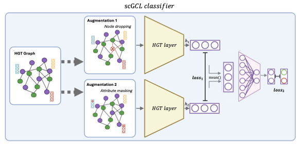

# FloREN a novel Interpretqble Heterogenous Graph Transformer Self-Supervised Learning architecture for Sample-Level Representations

<p align="center">
  
</p>


## 📥 Setup & Installation

### 1. Clone FloREN Locally

```bash

git clone https://github.com/iclemente99/FloREN

```

### 2. HGT Environment

```bash

# OPTION 1 - Create conda HGT environment
conda env create -f environment/hgt_env.yml
conda activate hgt_env

# OPTION 2 - Create uv HGT environment
curl -LsSf https://astral.sh/uv/install.sh | sh
uv venv hgt_env
source hgt_env/bin/activate
uv pip install environment/hgt_env.txt

```

### 3. Unzip Prior Knowledge Reference for Usage

```bash

# Make sure you are working on the repository directory
cd ~/FloREN

# Unzip the file
mkdir -p temp
unzip ./data/Prior_Knowledge_PRECISEADS_compI_compII.zip -d temp
unzip temp/*.zip -d temp/inner
mv "temp/inner/Prior_Knowledge_PRECISEADS (copy).csv" ./data/Prior_Knowledge_PRECISEADS.csv

```

## Understanding the Input

To run the FloREN pipeline, the input data must be organized in the `./data/` directory with specific formats for gene expression and cell connection data. Below are the requirements for each sample:

### 1. Gene Expression Matrices (`./data/count_matrices/`)
- **Location**: `./data/count_matrices/`
- **Format**: One matrix file per sample, stored as a text file (e.g., `.txt` or `.csv`).
- **Dimensions**: Each matrix should have dimensions `[N, M]`, where:
  - `N` = number of genes
  - `M` = number of cells
- **Content**: The matrix contains gene expression values, where rows represent genes and columns represent cells.
- **Naming**: Files should be named consistently with sample identifiers (e.g., `sample_Control01.txt`, `sample_RA05.txt`) to match metadata in `./data/metadata.csv`.

### 2. Cell-Cell Connection Matrices (`./data/cell_connections/`)
- **Location**: `./data/cell_connections/`
- **Format**: One matrix file per sample, stored as a text file (e.g., `.txt` or `.csv`).
- **Dimensions**: Each matrix should have dimensions `[M, M]`, where `M` = number of cells (matching the number of cells in the corresponding gene expression matrix).
- **Content**: The matrix represents cell-cell connections (e.g., adjacency or similarity matrix). If no cell connection data is available, provide an empty (zero-filled) matrix of the appropriate size.
- **Naming**: Files should match the sample identifiers used in `./data/count_matrices/` (e.g., `sample_Control01.txt`, `sample_RA05.txt`).

### Notes
- Ensure that the sample names in `./data/count_matrices/` and `./data/cell_connections/` match the `patient_id` entries in `./data/metadata.csv`.
- If cell connection data is not available, you must still provide a zero-filled matrix in `./data/cell_connections/` for each sample to avoid errors in the pipeline.
- The pipeline assumes text files are space- or comma-separated. Adjust the file format if necessary to match the expected delimiter in the preprocessing scripts (e.g., `run_hgt.py`).

### 3. Metadata File (`./data/metadata.csv`)
- **Location**: `./data/metadata.csv`
- **Format**: A CSV file with exactly two columns: `patient_id` and `group`.
- **Content**:
  - `patient_id`: A unique identifier for each sample, matching the sample names in `./data/count_matrices/` and `./data/cell_connections/` (e.g., `Control01`, `RA05`). The `patient_id` should correspond to the prefix of the filenames (e.g., `sample_Control01.txt` has `patient_id` = `Control01`).
  - `group`: The group or class label for the sample (e.g., 0, 1), used for stratified splitting or downstream analysis.
- **Purpose**: Links each sample’s gene expression and cell connection matrices to its group label, enabling the pipeline to process samples according to their experimental conditions.

### Notes
- The CSV must include a header row with `patient_id` and `group`.
- Ensure `patient_id` values exactly match the sample identifiers in the filenames (after removing the `sample_` prefix).
- Missing or mismatched `patient_id` entries will cause errors in the pipeline (e.g., `ValueError: Patient ID not found in metadata`).

## 🚀 Usage

### Step 1: Build Heterogenous Graph

```bash

# Make sure you're in the activated environment

# Run floren_input.py function
python src/floren_input.py \
  --data_path './data/' \
  --output_path './floren_output/' \
  --epochs 150
  --grn_cutoff 0.9

```

### Step 2: Train Heterogenous Graph Transformer Self-Supervised Learning (HGTSSL) with Supervised finetunning

```bash

# Run floren_training.py
python src/floren_hgt.py
  --data_path './data/'
  --result_dir './floren_output/'
  --metadata_path './samples_metadata.csv/'
  --epcoh 100

```

### Step 3: Visualize results

```bash

# Run floren_visualization.py
python src/floren_visualization.py
  --data_path './data/'
  --result_dir './floren_output/'
  --metadata_path './samples_metadata.csv/'
  --epcoh 100

```

## ✍️ Citation & Acknowledgements

This work was developed at LBAI-UBO, inspired by methods from:

DeepMAPS (Nature Communications, 2023)
Graph Contrastive Learning (ICML, 2022)

Please cite accordingly if used in academic research.

## 🖥️ Maintainers

Iñigo Clemente Larramendi — inigo.clementelarramendi@univ-brest.fr
