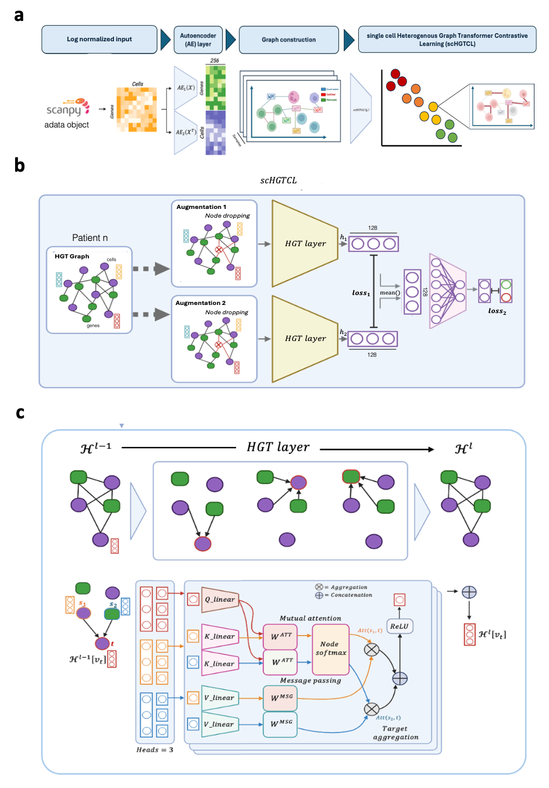

# FloREN: An Interpretable Sample Representation Method to unveil immune networks through Graph Transformers

<p align="center">
  
</p>


## 📥 Setup & Installation

### 1. Clone FloREN Locally

```bash

git clone https://github.com/iclemente99/FloREN

```

### 2. HGT Environment

OPTION 1 - Create conda HGT environment

```bash

conda env create -f env/hgt_env.yml
conda activate hgt_env

```

OPTION 2 - Create uv HGT environment

```bash

curl -LsSf https://astral.sh/uv/install.sh | sh
uv venv hgt_env
source hgt_env/bin/activate # For Windows run: hgt_env/Scripts/activate
uv pip install -r env/hgt_env.txt

```

### 3. Unzip Prior Knowledge Reference for Usage

```bash

# Make sure you are working on the repository directory
cd ~/FloREN

# Unzip the file
mkdir -p temp
unzip ./data/Prior_Knowledge_PRECISEADS_compI_compII.zip -d temp
unzip temp/*.zip -d temp/inner
mv "temp/inner/Prior_Knowledge_PRECISEADS (copy).csv" ./data/Prior_Knowledge_PRECISEADS.csv

```

## Understanding the Input

To run the FloREN pipeline, the input data must be organized in the `./data/` directory with specific formats for gene expression and cell connection data. Below are the requirements for each sample:

### 1. Adata object (`./data/`)
- **VARS**: The adata object should only contain the genes that you want to work with (e.x: 2000 HVG). adata.var_names will be the gene names used.
- **MATRIX**: The matrix used for the model is going to be the adata.layers['logcounts'] - Make sure that this layer exist and contains the log normalized data.
- **OBS**: The adata.obs_names will be the cell names used. The obs used are going to be "patient_id" for sample aggregation and "group" for supervised classification task.

### 2. Cell-Cell Connection Matrices (`./data/cell_connections/`)
- **Location**: `./data/cell_connections/`
- **Format**: One matrix file per sample, stored as a text file (e.g., `.txt` or `.csv`).
- **Dimensions**: Each matrix should have dimensions `[M, M]`, where `M` = number of cells (matching the number of cells in the corresponding gene expression matrix).
- **Content**: The matrix represents cell-cell connections (e.g., adjacency or similarity matrix).
- **Naming**: Files should match the sample identifiers used in `adata.obs.apatient_id`

## 🚀 Usage

### Step 1: Build Heterogenous Graph

```bash

# Make sure you're in the activated environment

# Run floren_input.py function
python src/floren_input.py \
  --data_path './data/binvignat_object_curated/' \
  --cell_comm_path './data/cell_connections/' \
  --output_path './floren_output/' \
  --epochs 150
  --grn_cutoff 0.9

```
**If cell_comm_path not given, the model will run without cell communication information.**

### Step 2: Train Heterogenous Graph Transformer Self-Supervised Learning (HGTSSL) with Supervised finetunning

```bash

# Run floren_training.py
python src/floren_hgt.py
  --data_path './data/binvignat_object_curated/'
  --result_dir './floren_output/'
  --epcoh 100

```

### Step 3: Visualize results

```bash

# Run floren_visualization.py
python src/floren_visualization.py
  --data_path './data/binvignat_object_curated/'
  --result_dir './floren_output/'
  --epcoh 100

```

## ✍️ Citation & Acknowledgements

This work was developed at LBAI-UBO. Please cite accordingly if used in academic research.

## 🖥️ Maintainers

Iñigo Clemente Larramendi — inigo.clementelarramendi@univ-brest.fr
